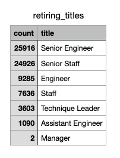
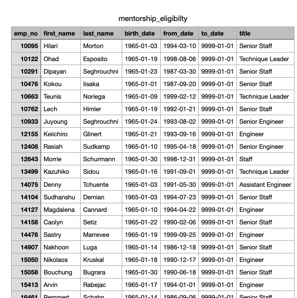

# Pewlett-Hackard-Analysis

<h1>Project Overview</h1>
We have been tasked with determining what employees of Pewlett Hackards are close to retirement, what departments they work in, and what their current roles are. We also needed to determine the number of retiring employees per title, and identify employees who are eligible to participate in a mentorship program. The companies “silver tsunami” can now be managed correctly since we were able to provide the necessary data to the client. These employees that were born between 01/01/1952 and 12/31/1955 needed to be listed in the retirement tables operate from the mentorship-eligible employees who were born between January 1, 1965 and December 31, 1965.

<h1>Resources</h1>

- Data Sources: departments.csv , dept_emp.csv , dept_managers.csv , employees.csv , salaries.csv , titles.csv

- Software: pgAdmin, GitHub, Visual Studio Code

- Dependencies: SQL
<body>
<h1>Summary</h1>

<h3> The Results</h3>

We created two tables with the final result information. The first is titled retiring_titles and the section is mentorship_eligibility. The first table is the smallest visually but represents thousands more employees and has the number of employees of retirement age counted per title. The second is much larger only in size and has more detailed information on each employee. Please see the attached images for reference:

- In the retiring_titles table we can see more than 50,000 employees are either a Senior Engineer or Senior Staff, and are close to or at retirement age 

- Inversely the Manager title/role only has two employees at or close to retirement age

- The mentorship-eligibility table is much longer for two reasons. First the table is broken down to list each employee that meets the requirements, and second the table is meant for only those who are close to but not at retirement 

- With the mentorship-eligibility table listing more than 1500 employees, Pewlett Hackard can create and implement at vast and well staffed mentorship program to ensure the company is prepared for the  “silver tsunami” 

<body>
  
<h1>Challange Summary</h1>
As you can see we have created really simplified the data and provided invaluable insight into the Pewlett Hackard “silver tsunami”. With this information managers and staff can focus on appropriate hiring, training, and mentorship. All to ensure that the company can minimize the “growing” pains of the inevitable change ahead. It is valuable to note that having created a company with suck loyal and consistent employees is an outstanding accomplishment, future generations of employees may have new needs and wants for the workplace in the years to come. This is an exciting time of change and growth for everyone involved. 
